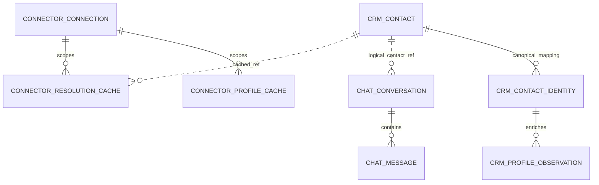

# Contact resolution, Connector cache và Chat message context

PLAN-006B / CHG-20261006-10 / ADR-019, accepted responsibility and semantic contract 2026-10-06 theo user. Target semantics; SRC-030 triển khai phần compatibility trên mock connections theo [local contract](contact-resolution-local.md). Provider enrichment, full message event family và extraction chưa triển khai. Ready cho phân chia trách nhiệm và invariant bên dưới; exact machine schemas, service authentication, physical migrations và dispatch fencing vẫn là gate PLAN-006 trước source. Không đổi strict API/events M2 hoặc envelope v2/v3 đã phát hành.

## Authority

| Service | Sở hữu | Không làm |
|---|---|---|
| CRM Connector | Webhook signature/durable capture/parse; Page connection/provider credential; gọi provider profile API lấy tên/avatar theo quyền; profile cache và resolution cache; điều phối resolve→Chat saga | Không tự tạo UUID Contact hoặc ghi DB CRM; cache không là nguồn identity mapping chính thức |
| CRM Core | Contact master; canonical external identity→crm_contact_id; resolve-or-create atomically; profile observations/provenance và merge policy; mapping revision/invalidation | Không gọi Facebook hoặc giữ Page access token |
| Chat | Conversation/Message/ownership/send intent; kiểm contact/identity/connection binding; input/output message context chứa crm_contact_id; API phục vụ agent workspace | Không tạo Contact, không tự suy Contact từ tên/PSID, không gọi API profile Facebook |
| Agent workspace / BFF | Đọc Conversation/Message từ Chat, Contact summary từ CRM theo quyền; kết hợp để hiển thị | Không dùng cache Connector làm authorization hoặc sửa owner qua Contact |

Canonical identity key: `(tenant_id, platform, connection_id, external_subject_id)`. Với Messenger, external_subject_id là PSID trong namespace connection/Page. connection_id phải bind cố định đúng Page; không tự remap connection sang Page khác. Provider identity observations ở Connector không phải canonical CRM contact_identity. Cùng PSID ở connection/tenant khác không tự gộp Contact. Không merge bằng display name/avatar; Contact hiện hữu chỉ được dùng khi đã có mapping hoặc liên kết được xác minh bởi CRM.

## Inbound flow

1. Verify signature, bind tenant/Page, normalize và commit durable capture; ACK Facebook ngay sau commit, không chờ enrich/CRM/Chat.
2. Connector và Chat đều dùng cache-aside qua cùng semantic `GetOrResolveContactIdentity`: cache hit hợp lệ trả mapping; miss/expired thì lookup mapping đã lưu trong CRM DB và nạp lại cache. Không coi cache miss là Contact chưa tồn tại.
3. DB có mapping: trả crm_contact_id/crm_identity_id/mapping_revision, không gọi create. DB xác nhận không có mapping: gọi CRM Core ResolveContact để atomically tìm lại hoặc tạo Contact+identity, rồi cache confirmed receipt. Hai caller đồng thời dùng cùng identity key vẫn chỉ có một canonical mapping.
4. Connector gọi Chat IngestMessage với crm_contact_id bắt buộc. Chat cache miss thì load mapping từ DB qua read port; đối chiếu tenant/identity/contact với input và Conversation. Cache hit hợp lệ không bắt buộc RPC CRM trên mỗi message. Thiếu mapping trong DB mà caller đã đưa một crm_contact_id không xác minh được: reject/pending, không tạo Contact khác để hợp thức hóa input.
5. Các lượt tiếp theo dùng cache mapping. CRM DB là SoT; cache ở mỗi service là disposable, chỉ được ghi từ DB read hoặc confirmed CRM receipt. Permission/owner/provider control được kiểm riêng trước side effect.
6. Profile enrichment do Connector thực hiện độc lập: dùng cached observation nếu có; miss/expired schedule provider GET rồi SyncContactProfile. Không chờ tên/avatar để resolve Contact hoặc đưa message vào Inbox; không overwrite Human fields. Không mặc định mọi Page có quyền đọc profile.

**Đường truy cập DB:** baseline monolith dùng read/application port của CRM module, repository đọc DB. Khi tách microservices, cùng port được triển khai bằng CRM read API (CRM đọc DB) hoặc service-owned projection được đồng bộ; không tự cấp Connector/Chat SQL credentials vào CRM DB. Lựa chọn direct shared-DB read là thay đổi ADR-017 riêng, chưa được suy ra từ cache-aside. Quy tắc lookup DB trước create giữ nguyên ở cả hai deployment. Projection miss không phải bằng chứng authoritative absence: fallback CRM read trước create.

CRM unavailable/cache invalid: giữ message chờ; timeout/403/5xx không được hiểu thành “không có identity”. Profile unavailable vẫn resolve Contact tối thiểu và retry enrichment riêng. Chat unavailable: giữ Contact đã tạo, retry cùng operation/event IDs, không delete Contact như compensation. Chat có thể dùng resolver port ở bước chuẩn bị context của trusted adapter; domain IngestMessage vẫn bắt buộc crm_contact_id, không nhận null rồi tự suy Contact. Trong luồng Facebook, Connector chuẩn bị context trước nên Chat thông thường chỉ đọc/validate mapping đã tồn tại.

## Cache policy và làm giàu

Profile cache ở Connector và identity-resolution cache ở cả Connector/Chat (chưa có DDL):

- `provider_profile_cache`: identity key, display_name?, avatar_url?, observed_at, fetched_at, expires_at, profile_revision, status, retry_after; không chứa provider token. Positive TTL mặc định24 giờ, giới hạn sớm hơn theo hạn URL/provider nếu biết; negative cache5 phút (429 tôn trọng Retry-After). Refresh single-flight theo identity, backoff có jitter. Không block message vì profile refresh thất bại. Adapter endpoint/fields/permissions cụ thể cần source/capability proof trước code.
- `contact_resolution_cache`: identity key, crm_contact_id, crm_identity_id, mapping_revision, resolved_at, expires_at; TTL5 phút là baseline kỹ thuật. Invalidate khi mapping corrected/merged/archived, connection disabled/rebound hoặc tenant revoked. Cache miss sau restart lookup mapping trong CRM DB qua read port, hydrate nếu đã có; chỉ authoritative absence mới gọi CRM resolve/create. CRM mapping authoritative giữ bền vững; Redis có thể tăng tốc cache, không giữ duy nhất saga receipt.

CRM profile observation lưu source identity, observed_at và revision, tên/avatar nullable; tách khỏi field do Human chỉnh. Enrichment chỉ điền field trống/default do provider quản lý hoặc cập nhật provider observation mới hơn; không overwrite tên/contact field đã được người dùng chốt, không xóa field khi response thiếu, không lùi dữ liệu theo delayed result. Refresh profile gửi command SyncContactProfile riêng với operation ID/digest riêng, không sửa body của ResolveContact đang retry. Duplicate observation no-op; older revision ignored.

Avatar URL là untrusted, có thể hết hạn và chứa query nhạy cảm; không vào audit/bus/log. Không fetch URL tùy ý từ client. Binary download/proxy/scan/SSRF theo Media contract riêng; UI dùng đường render được kiểm soát và fallback initials khi chưa có resolver hoặc URL expired. Lưu avatar_url observation không đồng nghĩa đã có public avatar endpoint.

Mapping cache không thay authorization. Cache entry chứa mapping_revision, trạng thái và expires_at; dùng khi chưa expired/invalidated và không có known synchronization gap. CRM mapping change/invalidation event có revision; consumer bỏ stale revisions, phát hiện gap thì invalidate và đọc lại DB. Cache không tự gia hạn TTL khi hit. Exact transport/watermarks và cửa sổ stale tối đa còn implementation gate; TTL5 phút là baseline performance, không phải guarantee immediate revocation.

Khi cache→input→Conversation không khớp, refresh từ DB một lần; nếu vẫn mismatch trả CONTACT_BINDING_STALE, không tự remap Conversation hoặc tạo Contact khác. DB unavailable thì pending/retry thay vì create. Không có per-message CRM validation bắt buộc cho valid cache hit; với merge/archive/identity reassignment, cần protocol fence/invalidation và historical-message policy trước khi bật mutation đó. Không claim stale cache an toàn cho privileged send; live authorization/owner/control checks vẫn theo dispatch gate. Retry same operation giữ immutable body/receipt; thay context sau terminal rejection dùng operation mới với business dedup key được giữ.

## Semantic contracts đích (chưa phải route deployed)

Command envelope theo [cross-service rules](service-boundaries.md): schema_version, operation_id, idempotency_key, tenant_id, producer/service identity, correlation_id. Auth kiểm audience/scope/connection/tenant ở server; tenant_id hoặc crm_contact_id trong body không đủ làm quyền.

**LookupContactIdentity v1** Connector/Chat→CRM read port: nhận authenticated identity key, trả `found` với crm_contact_id/crm_identity_id/mapping_revision/status, hoặc authoritative `not_found`. Transport/auth errors không trả not_found. Chỉ lookup scope được caller phép truy cập; không expose existence cho tenant khác.

**ResolveContact v1** trusted Connector/Chat resolver→CRM (normal Facebook path do Connector gọi):

| Field | Rule |
|---|---|
| platform, connection_id, external_subject_id | Required identity key; connection validated via authenticated Connector binding authority |
| profile_observation | Optional display_name/avatar_url + observed_at/profile_revision/source; no token or transcript |
| result.crm_contact_id, crm_identity_id, mapping_revision | Required on success; CRM generates IDs, existing canonical mapping wins |
| result.created | Boolean; true nếu operation tạo Contact, false nếu operation dùng mapping hiện hữu; replay trả nguyên stored receipt, không đổi created |

CRM unique identity key và transaction Contact+mapping bảo đảm hai worker resolve lần đầu không tạo hai Contact, kể cả operation IDs khác nhau. Idempotency scoped tenant+calling service+operation key; cùng key khác canonical body409. Network call không nằm trong SQL transaction. Validate binding qua remote authority trước mutation, rebind connection bị cấm. Timeout sau commit: lookup operation receipt hoặc retry nguyên body/key; không tạo Contact khác. Contact mới không tự tạo Lead hoặc thành Customer.

**Chat MessageContext v1** required cho mọi message command/input và domain message event inbound/outbound của interface mới:

| Field | Rule |
|---|---|
| crm_contact_id | Required UUID, non-null: Contact phía khách hàng ở cả inbound, outbound và provider echo |
| tenant_id, platform, connection_id | Required, checked against authenticated binding; no cross-tenant refs |
| crm_identity_id, external_subject_id, mapping_revision | Required resolved identity context; Messenger inbound=sender PSID, outbound/echo=recipient PSID |
| direction | inbound hoặc outbound; không suy từ owner Human/AI |
| conversation_id | Optional only for first IngestMessage before Chat creates conversation; required on sends and persisted message events |
| event_id / operation_id / message_id | Stable event/operation IDs for dedup; Chat assigns internal message_id on first persisted message; required on its emitted message events |
| external_msg_id | Provider ID when available; may be null on queued outbound before receipt |
| content or content_ref | Typed, versioned rich content on authenticated command; minimized content_ref on bus, no transcript/profile/token in generic events |

SendMessage từ workspace/AI gateway cũng có crm_contact_id; BFF derives from authorized Conversation, không tin client chọn Contact khác. Chat checks it equals conversation.crm_contact_id and the current canonical identity binding before enqueue/dispatch. Chat→Connector DispatchMessage và Connector→Chat observed outbound/echo carry the same crm_contact_id. Actor Human/AI principal là field riêng; không dùng actor ID/Page ID làm Contact ID. External echo chưa correlatable phải resolve customer identity trước khi phát Chat message; không guess theo text/time, không trigger duplicate reply.

Chat emitted `chat.message.received`, `chat.message.sent`, `chat.message.updated` và `chat.send.requested` đều có MessageContext gồm crm_contact_id trong payload mới; event names/version binding exact phải được machine-schema gate xác minh. Delivery/read message-linked observations phải correlate message→contact trước khi đưa vào domain event; chưa correlate giữ pending ở Connector. Raw webhook capture trước resolve và pure Page/control events không phải Chat message events nên không fabricate Contact ID cho chúng.

## Target ERD và compatibility

Dotted relations là logical cross-service reference, không SQL FK. Chat Conversation/Message logical model giữ crm_contact_id nhất quán; physical denormalization và local composite constraint chốt tại migration gate. Connector resolution cache có crm_identity_id và mapping_revision; không copy CRM master.

Supersedes target ownership grouping contact_identity với Connector trong PLAN-005, không đổi physical monolith hiện tại hoặc Connector schema2. Extraction future phải chuyển/backfill canonical mappings sang CRM, giữ UUID/tenant/connection/Contact IDs, single-writer fence và audit consistency; cache chỉ rebuild sau CRM receipt. Không sửa migrations1–18 hoặc Connector1–2.

Field crm_contact_id required là breaking đối với strict API/events đã phát hành. Dùng contract version/route/event version mới, compatibility adapter hydrate từ authoritative conversation.contact_id cho legacy messages; không relabel mock thành messenger. Old endpoints và pinned consumers giữ schema cũ đến rollout/drain. Source gate gồm JSON Schema/OpenAPI/generated TS, auth/delegation, profile API evidence, DDL/index/retention/invalidation, retry/errors và fixture contract tests; PLAN-006B không tự promote toàn bộ PLAN-006 hoặc tạo source READY.

## Acceptance phải có trước DONE source

Cache miss+DB hit: hydrate, zero create calls. Cache miss+DB absence: idempotent CRM create Contact/identity, hydrate, deliver Chat message with ID. Cache hit: no mandatory CRM read/resolve RPC; local context checks and separate authorization still apply. Provider GET/enrichment independent from message delivery. DB timeout/denied/5xx never treated as absence; Chat-provided unverified contact ID cannot trigger substitute creation. Duplicate/concurrent first events and lost CRM/Chat ACK create no duplicate Contact or Message. Profile denial/timeout/429 still permits minimal Contact; no human field overwrite/stale refresh. Cross-tenant/Page identity collision denied; cache stale/merge/archive/disable stops dispatch until reconciled. Missing/null/mismatched crm_contact_id rejected on both directions; echo uses customer recipient, never agent/Page. Cache flush/restart rebuild safe; secrets/avatar query strings absent from generic event/audit logs. Workspace renders same Contact on inbound/reply; media/avatar failure fallback. All runtime cases NOT_RUN for this design task.

PLAN-006C / CHG-20261006-11 supersedes PLAN-006B per-message synchronous ValidateContactBinding requirement with DB-backed cache-aside. Exact invalidation/fencing availability guarantees remain unimplemented gates.
