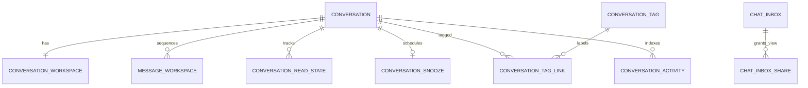

# Agent Chat workspace — data design UX-002

Status: Ready design specification; schema20/21 implemented SRC-032/033, schema22 source under SRC-034 verification. [Contract](../contracts/agent-chat-workspace.md) là nguồn DTO/semantics. Thiết kế bảng thuộc Chat trừ Contact properties và CRM note; target service không dùng FK sang CRM/Identity/Workflow DB.

## Types và invariants

UUID CHAR(36) ascii_bin; UTC DATETIME(6); revision/sequence BIGINT UNSIGNED, wire decimal strings; text utf8mb4. Entity IDs tenant-bound; PK/FK nội bộ luôn gồm tenant_id. Default revision1, timestamps created_at/updated_at. No hard-delete business history; archive flags và tombstones giữ dedup. Cross-service principal/team/contact refs validate qua ports/API, không thành writer thứ hai.

| Entity / owner | Persisted fields và keys | Invariant / index |
|---|---|---|
| conversation_workspace / Chat | PK(tenant_id,conversation_id), latest_inbound_seq default0, answered_inbound_seq default0, last_message_at, waiting_since nullable, waiting_metric_state ready/unavailable, snoozed_until nullable, snooze_revision default0, tag_set_revision default0 | 0<=answered<=latest; local FK Conversation; indexes(tenant,snoozed_until,conversation_id), (tenant,last_message_at,conversation_id), (tenant,waiting_since,conversation_id) |
| message_workspace / Chat | PK(tenant_id,message_id), conversation_id, inbound_seq nullable, reply_through_inbound_seq nullable | Unique(tenant,conversation,inbound_seq); local FK message/conversation; inbound seq>0 chỉ inbound; reply coverage chỉ outbound, <=latest khi submit |
| conversation_read_state / Chat | PK(tenant_id,conversation_id,principal_id), id UUID, last_read_inbound_seq default0, revision, updated_at | Unique(tenant,id) cho event aggregate_id; max monotonic, <=latest dưới lock; principal Human tenant-bound; index(tenant,principal,conversation) |
| conversation_snooze / Chat | PK(tenant_id,conversation_id), until nullable, revision, actor_principal_id, reason nullable VARCHAR(250), last_cause, updated_at | workspace due field đồng bộ cùng local tx; một active deadline; worker CAS revision; reason không publish/audit raw |
| chat_inbox / Chat | PK(tenant,id), creator_principal_id, name VARCHAR(80), predicate_schema_version SMALLINT=1, predicate JSON, sort enum, version, archived_at nullable, timestamps | index(tenant,creator,archived_at,id); JSON validated grammar, max50 active/creator được kiểm lock quota |
| chat_inbox_share / Chat | PK(tenant,inbox_id,target_kind,target_id), created_at | target_kind principal/team, local FK inbox; index(tenant,target_kind,target_id,inbox); max50 under inbox lock |
| conversation_tag / Chat | PK(tenant,id), name VARCHAR(40), normalized_name VARBINARY(256), color enum, version, archived_at, timestamps | Unique(tenant,normalized_name), NFC/casefold app canonical; never reuse archived normalized name silently |
| conversation_tag_link / Chat | PK(tenant,conversation_id,tag_id), actor_principal_id, created_at | Local composite FK Conversation/tag; index(tenant,tag,conversation); max20 under Conversation lock |
| chat_snippet / Chat | PK(tenant,id), title VARCHAR(80), shortcut VARCHAR(32) ascii_bin, text TEXT <=4000 chars, version, archived_at, timestamps | Unique(tenant,shortcut); content is tenant configuration, no raw body in logs |
| conversation_activity / Chat | PK(tenant,id), conversation_id, activity_seq, source_service, source_kind, source_id, source_revision, kind, actor_kind/id nullable, occurred_at, recorded_at, payload JSON | Unique(tenant,conversation,activity_seq); unique(tenant,source_service,source_kind,source_id,source_revision,conversation); index(tenant,conversation,activity_seq); no message/note body copy |
| conversation_activity_counter / Chat | PK(tenant,conversation_id), last_seq default0 | Sequence allocated transactionally under local lock; activity order is recording order |
| chat_workspace_rollout / Chat | PK(tenant,feature_key), state(disabled/backfilling/ready), watermark JSON, updated_at | Backfill checkpoint durable; typed watermark validated by feature, no personal content |
| chat_read_rollout_principal / Chat | PK(tenant,principal_id), rollout_id, created_at | Immutable cohort Human hiện hữu khi rollout; Identity refs được validate qua port |
| chat_read_rollout_conversation / Chat | PK(tenant,conversation_id), rollout_id, baseline_inbound_seq | Immutable per-Conversation cutoff cho lazy marker; local FK Conversation, seq không đổi theo first open |
| Contact address/preferred_language / CRM | Standard property definitions + typed values via existing registry | Optional string500/string35 BCP47; existing Contact field read/write ACL; no new customer state |

Metrics counts không là mutable global table: query từ authoritative rows và read state với ACL. Nếu thêm cache/projection về sau, key tenant+viewer+auth revision+predicate version và invalidate; không đổi semantics contract. waiting_seconds tính as_of ở read, không tick/update từng giây trong DB.

## Quan hệ logical

ERD chỉ quan hệ nội bộ Chat. Inbox predicate tham chiếu tag/team/channel UUID có validate, không FK JSON sang service DB. Shared inbox là permission xem definition, không grant record. Notes vẫn CRM Activity, activity index chỉ chứa ref; permissions bị thu hồi phải filter tại read.

## Write paths và concurrency

Inbound: existing message dedup và Conversation lock → allocate inbound_seq, insert sidecar, update last_message_at/waiting, wake snooze nếu active, append activity/audit/outbox → commit. Transaction rollback không tăng sequence; replay không wake/sinh unread. Outbound submit chụp coverage vào sidecar; sent-result CAS update answered watermark và tìm inbound chưa covered; late receipt không hạ watermark. Tag/snooze command dùng cùng Conversation lock order của baseline để tránh deadlock với assignment/close.

Read marker không bump Conversation/owner version: row revision riêng, monotonic update cùng check latest. Activity status không copy vào history item; response hydrate live. Cross-service note/automation delivery: source outbox → Chat inbox dedup/projection → read via source-authorized port, không distributed transaction. Chat-owned lifecycle/tag/snooze activity ghi cùng transaction để UI thấy sau commit.

## Migration/retention

Schema22 also implements `chat_workspace_rollout` for tenant-level snooze/activity disable/backfilling/ready overrides. An absent override uses installed implementation readiness; a disabled flag blocks new routes/commands but never stops writer hooks or due-deadline draining. Activity capabilities additionally require completed Conversation backfill. Disable is a read/command rollout fence, not an instruction to discard projection or timers.

SRC-034 physical refinement (CHG-20261006-22): append schema22 for snooze/activity tables. Activity counter includes `backfilled` boolean; per-Conversation backfill holds the same record fence as live writers, reads source batches of200, deduplicates provenance and commits counter/rows atomically. Workflow adds source-owned `activity_revision` default0; source transitions increment it in the outbox transaction. Existing runs do not receive invented started events. Chatflow uses its existing session version. Snooze stores `until_at` physically, wire `until`; global deadline index `(until_at,tenant_id,conversation_id)` supports bounded worker scans. Activity payload never stores source message/note bodies. Local source ports verify binding, hydrate content/ACL and expose pending-notification freshness; extraction must replace them with versioned APIs.

Forward migrations mới, không rewrite applied history. Add sidecars/indexes/counters trước; backfill batch có checkpoint + reconciliation count/hash; lúc cutover fence Conversation writers để catch-up delta rồi dual-write **cùng Chat local transaction**, không hai service cùng sở hữu. Marker initial rollout watermark cho existing Humans được materialize/lazy initialized từ immutable per-Conversation watermark và principal rollout cohort; không dùng latest tại first open vì sẽ nuốt tin mới sau rollout. Cohort/cutoff lưu ở hai bảng rollout riêng, giữ tới khi tất cả marker liên quan materialize; không TTL tự hết hạn làm lịch sử thành unread. Principal không thuộc cohort hoặc Conversation tạo sau cutoff dùng marker0. Implementation migration phải có test crash/restart và kích thước bounded batch.

Message legacy outbound coverage không được dựng chỉ từ timestamp provider: lịch sử đã closed không có waiting; active chưa xác minh coverage giữ waiting_metric_state=unavailable đến next confirmed covered reply hoặc reconciliation. Seq backfill vẫn phục vụ unread bằng received_at/id. Activity backfill chỉ từ record thật, không bịa Workflow started.

Không purge message sidecars/read markers/dedup tombstones độc lập source retention; archive Contact/Conversation theo policy hiện hữu. Identity disable giữ marker/inbox refs nhưng không cho truy cập; archive inbox/tag/snippet giữ IDs trong history. Purge/privacy sau này phải cùng tenant/source retention policy; không thêm auto TTL xóa lịch sử ở UX-002. Secrets/transcript không vào rollout state, audit hoặc tracking evidence.

SRC-040: Conversation exposes derived read-only need_response:boolean|null from existing Chat conversation_workspace.waiting_since/waiting_metric_state and lifecycle, per workspace contract. No new column/table, migration or data backfill; existing reply sequence coverage stays source of truth.

SRC-041 supersedes SRC-040 inference: new inbound remains need_response=null (unknown), never automatically true from waiting_since. A future authorized Workflow/Chatflow action can apply a rule-based or Assist-proposed assessment. Assist has no direct data mutation permission. Raw causal coverage still owns sent completion; no storage change. [Rules](../contracts/agent-chat-workspace.md).

UX-006 target replaces independent need_response with nullable next_action carrying registered type (response/create_lead/create_ticket/close_chat). Chat owns current suggestion, provenance/basis/revision; workflow/chatflow applies rule or Assist output via authorized action. Sent evidence/read markers/lifecycle remain independent. No target duplicate boolean; exact storage and legacy compatibility remain PLAN-008, no table/migration added here. [Product model](../ux/agent-assist-response.md).
