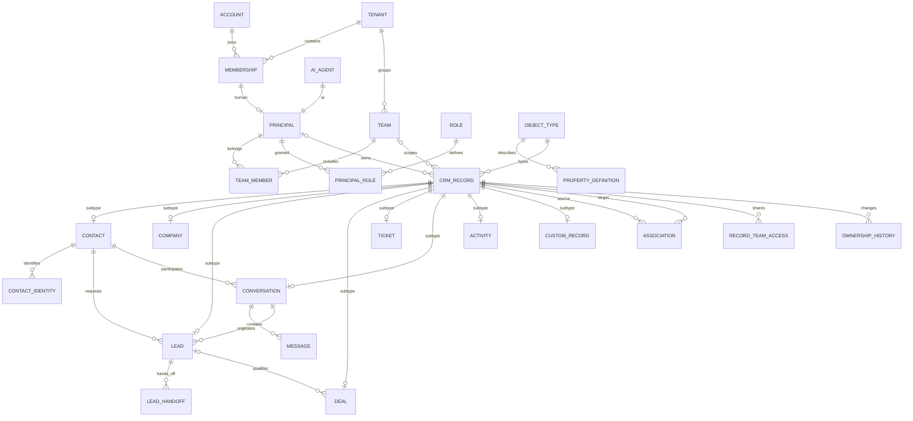
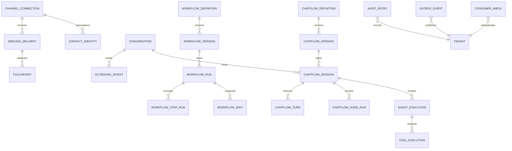

# Data model và ERD

Status: Ready for implementation cho M1–M2. Deal/Ticket/report authoring là mô hình đích Draft M4–M5.

## Invariant chung

- ID dạng UUID v7, lưu `CHAR(36)` ASCII binary collation; API là string. Fixture dùng UUID cố định; tên ngắn trong kịch bản chỉ là alias.
- Bảng tenant-scoped có `tenant_id`, `id`, `created_at`, `updated_at`; thêm unique `(tenant_id,id)` để composite FK cùng tenant. Không có bảng nghiệp vụ được phép bỏ tenant.
- Registry `crm_record` có row `version`, `owner_revision`, `object_type_id`, owner/team nullable và `archived_at`. Mọi bảng standard subtype dùng `(tenant_id,record_id)` PK/FK; custom record cũng vậy.
- Domain state và registry version cập nhật cùng transaction. API trả version từ registry, không tạo hai nguồn version.
- Không hard-delete principal đã có history; suspend/archive giữ FK. FK owner bảo đảm principal cùng tenant; service actor không nằm trong bảng principal.
- API field dùng snake_case; timestamp RFC3339 UTC; tiền dùng decimal string + currency, không float.

## ERD nền móng

Đường association source/target đều tham chiếu registry; cardinality và allowed object type do `association_type` kiểm tra. Mỗi registry record có đúng một subtype khớp object type; application service tạo atomically, kiểm thử integrity kiểm tra orphan/mismatch.

## ERD thực thi

## Standard và custom objects

Object registry seed trong từng tenant: `contact`, `company`, `lead`, `deal`, `ticket`, `conversation`, `activity`. M1–M2 chỉ expose CRUD/state transition cho object được contract cho phép. Tenant không được đổi semantic standard field hoặc tự tạo record Deal qua generic API để vượt milestone.

`property_definition` dùng các type M1: string, text, integer, decimal, boolean, date, datetime, enum. Relation dùng association, không giấu ID reference trong string property. Field key bất biến; label có thể đổi; required/default/enum options và `sensitive` thuộc metadata version.

Standard field ở cột typed, custom property của mọi object nằm trong `crm_record.custom_values` JSON keyed theo immutable property key. `custom_record` đánh dấu subtype, không lưu một bản JSON thứ hai. Cấm ghi standard field vào JSON.

Custom query dùng bảng `property_index_value` với các cột typed theo property type; unique `(tenant_id,record_id,property_id)`. Index update cùng transaction với JSON khi property có `indexed=true`; query chưa index trả lỗi `FIELD_NOT_QUERYABLE`, không silently scan toàn bộ JSON. Chỉ bật indexed lúc tạo property trong M1; bật sau/backfill là thiết kế M5.

Không dùng một generated column cho mỗi field mỗi tenant. MySQL có hỗ trợ [index qua generated column trên JSON](https://dev.mysql.com/doc/refman/8.4/en/create-table-secondary-indexes.html), nhưng đây chỉ là lựa chọn tối ưu sau khi đo tải. M1 dùng typed projection dùng chung.

M1 cho create object/property và đổi label; không đổi type hoặc xóa property có dữ liệu. Enum bỏ option dùng archive; dữ liệu cũ vẫn đọc được. Form/view M1 là cấu hình field/order/filter qua API, chưa có drag-and-drop builder.

## Identity, dedup và attribution

External identity unique theo `(tenant_id,connection_id,external_subject_id)`. Messenger PSID được hiểu trong namespace connection/Page; tuyệt đối không so PSID qua Page để gộp người. Phone/email lưu chuẩn hóa nếu có nhưng không tự merge Contact ở M2. Hai identity chưa được xác minh liên hệ là hai Contact; merge có audit thuộc backlog.

Một Conversation active cho mỗi contact identity. `conversation.active_identity_key` bằng identity ID khi open/pending, NULL khi closed; unique `(tenant_id,active_identity_key)` cho phép lịch sử closed. Lock identity khi tìm/tạo conversation để tránh race; new message sau closed tạo Conversation mới.

Một Lead từ một Chatflow qualification session: unique `(tenant_id,qualification_session_id)` khi có session; Lead thủ công dùng Idempotency-Key. Không dùng contact ID làm unique Lead vì một người có nhiều nhu cầu.

Touchpoint giữ nguồn provider, campaign/ad IDs nullable, thời điểm xảy ra/nhận và metadata đã allowlist. Không suy diễn ad ID khi thiếu. Lead chốt `source_touchpoint_id` từ touchpoint CTM sớm nhất trong Conversation tại lúc qualify; nếu không có thì NULL/unknown. Touchpoint đến muộn không viết lại snapshot ngầm.

## Pipeline, lifecycle và chỉ mục

Lead M2 dùng trạng thái cố định `new → qualifying → qualified → handed_off → accepted`, cùng `disqualified`; không sửa state qua generic PATCH. Deal/Ticket pipeline tùy biến thuộc M4; stage có semantic category để report không phụ thuộc label.

Customer projection dùng `customer_since` thời điểm thắng đầu tiên, không xóa khi Deal bị reopen; số Deal đang thắng là metric riêng. Correction dữ liệu sai yêu cầu audit action riêng ở M4.

Index chính: owner queue `(tenant_id,object_type_id,owner_principal_id,updated_at,id)`; team queue `(tenant_id,object_type_id,team_id,updated_at,id)`; message `(tenant_id,conversation_id,received_at,id)`; outbox `(status,next_attempt_at,id)`; run/wait `(tenant_id,status,resume_at,id)`; inbound unique provider key. Query always tenant-scoped; global worker scan chỉ đọc delivery IDs rồi khởi tạo tenant context.

Chi tiết field và constraint nằm trong [dictionary](dictionary.md).

## SRC-014 physical implementation

Migration v9 thêm channel_connection → contact_identity → conversation (registry subtype), outbound_intent → message và mock_outbound_receipt. Composite tenant FK bảo đảm identity/contact/connection đồng nhất; generated active_identity_key unique. Chi tiết [physical schema](physical-schema.md), [dictionary](dictionary.md). Inbound delivery/touchpoint chưa triển khai; Lead/session refs vẫn fail closed.

SRC-015 v10 bổ sung channel_connection credential/service actor → inbound_delivery → identity/Conversation qua ports và touchpoint CTM. Worker transaction commit Message/touchpoint/processed cùng nhau; event-key và message-key dedup riêng. Không thêm FK Lead/session hoặc Workflow tables.

SRC-017 physical v11: routing_cursor references team/principal by tenant; agent_capacity_slot references principal with execution UUID reserved for SRC-018; routing_attention references crm_record. Ownership remains in crm_record/history, with no cascading owner change from Conversation to Lead. [Exact routing contract](../contracts/routing.md).

SRC-018 physical v12: agent_execution has same-tenant Conversation/principal/service_actor/policy references; tool_execution references execution by tenant. Session binding uses an application port until SRC-020 adds its table/FK. Capacity slot reservation/release is atomic with execution state. No cross-module direct session/Contact writes.

SRC-019 physical v13 adds Workflow definition/version/run/step/wait/action/trigger_selection with same-tenant FKs; immutable version and service role pinning, stable action ledger and durable child-cancel request. Children stay behind owning-module UoW ports; production Chatflow/Sales integration follows SRC-020/021.

SRC-020: Chatflow physical session/turn/node state and Lead session binding are implemented by v14–v16; see [dictionary](dictionary.md) and [Chatflow contract](../contracts/chatflow.md). Workflow/Runtime use owning-module ports; Human completion commits Lead+session+event together.
