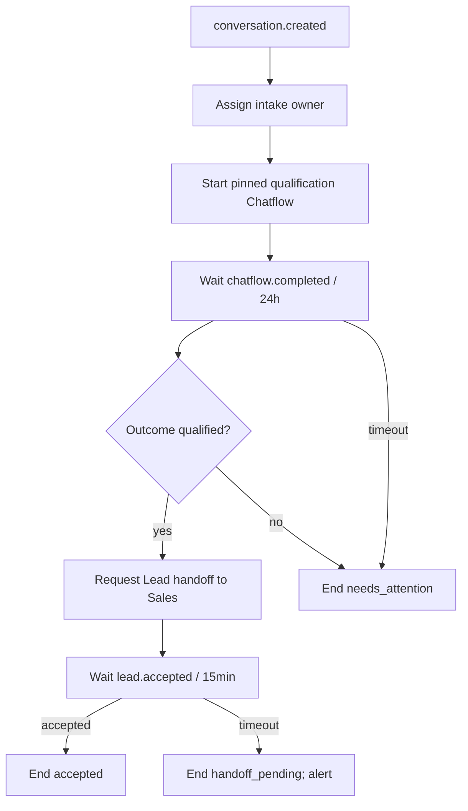

# MOD-08 — Workflow

Status: Primitive engine M2 implemented SRC-019; visual builder Draft M5. Requirements: REQ-08, REQ-09.

## Mục tiêu và phạm vi

Điều phối cross-module có durable state, version và retry. M2 publish graph bằng JSON qua admin API; không build canvas hay cho chạy JavaScript tùy ý.

## Actor và quyền

Designer cần automation.design; publisher cần automation.publish; run dùng service actor tenant-scoped và execution role pinned. Publish không tự cấp quyền runtime vượt service actor hiện hành.

## Use case và state machine

Version draft → published bất biến; sửa tạo version mới. Run `queued → running ↔ waiting → completed|failed|cancelled`; terminal không tự reopen. Step pending → running → succeeded/failed; retry transient giữ action key. Cancel ngăn step chưa chạy và ghi durable child-cancel request; worker retry tối đa5 lần/15s, attention giữ khi hết retry; không đảo tác dụng đã commit.

Graph có shape `{trigger,entry_node,nodes:[{key,type,config,next?}]}`. Key unique, mọi node reachable, graph acyclic, tối đa 50 nodes. M2 không parallel branches/loop/subworkflow/arbitrary code. Condition node có `on_true/on_false`; end không next. Binding chỉ path trong `trigger` hoặc output node trước đó; không expression eval.

| Primitive | Config tối thiểu | Output / guard |
|---|---|---|
| trigger | event_type=conversation.created, connection_id | trigger aggregate/contact IDs |
| assign_owner | record_id binding, team_id, capability, preference | owner_id nullable,owner_revision; no candidate đi tiếp queue attention |
| start_chatflow | conversation_id, chatflow_version_id | session_id; version phải published |
| wait_event | event_type, match_key binding, timeout_seconds | persisted result hoặc timed_out; chỉ child chatflow.completed / lead.accepted M2 |
| condition | left binding, op(eq/exists), right?, on_true,on_false | typed boolean; absent eq=false |
| request_lead_handoff | lead_id binding,target_team_id | handoff_id,lead_id |
| wait_timer | duration_seconds | woke_at; 1…86400 giây |
| end | outcome string | completed |

Wait timeout bắt buộc edge `on_timeout`; max 86400s. `wait_event` match key là child session_id hoặc handoff_id thuộc run, không broad tenant event match. Context output chỉ persist IDs/qualification outcome cần thiết; không raw transcript.

Binding dùng JSON object `{ "ref": "trigger.aggregate_id" }` hoặc `{ "ref": "outputs.start.session_id" }`; literal giữ đúng JSON type. Chỉ ref tới trigger envelope hoặc output node dominator đã chạy. Node có key `start` là ví dụ; không có string interpolation, property access ngoài allowlist hoặc expression code. Publish kiểm tra type output/input và mọi nhánh tới end.

## Graph chuẩn M2

Handoff vẫn pending sau wait timeout; workflow hoàn tất outcome handoff_pending, không đánh dấu Lead accepted/cancelled. Human cần có quyền tiếp tục xử lý. Parent run cancel yêu cầu cancel child đang active; Lead đã tạo/handoff không xóa.

## Entity và invariant

[Execution dictionary](../data/dictionary.md): run pin version; unique `(tenant,version,trigger_event)`; starter chọn version một lần. Step action key=`run_id:node_key`, không gồm attempt. Lease 60s; worker heartbeat 15s; recovery worker mỗi 15s claim expired step và replay bằng cùng action key. M2 primitive không có network I/O dài trong transaction; external execution thuộc child Chatflow.

Wait state và subscription persist trước nhả worker; check current child state lúc register để tránh lost signal. Step lease takeover tăng fencing token; commit phải khớp token, tránh worker cũ ghi đè kết quả.

## API và event

[Automation API](../contracts/api.md), [events](../contracts/events.md). Publish validate graph type/binding, service actor quyền, referenced team/version tồn tại cùng tenant. Consume conversation.created; emit workflow.completed/execution.failed. Không publish lại version đã published với body mới.

## UI

M2 chỉ danh sách definition/version và run detail read-only, node trạng thái/error sanitized. JSON fixture là authoring chính; builder kéo thả M5.

## Failure handling

Retry policy chung 5 lần; permission/validation → failed và attention. Redis mất được outbox/recovery khôi phục. Worker crash sau action commit trước step success dùng action idempotency để không lặp business write.

## Acceptance và dependency

[AC-08, AC-16, AC-17](../quality/acceptance.md); phụ thuộc Operations, command interfaces CRM/Agents/Sales/Chatflow; Workflow không viết bảng nghiệp vụ của chúng.

## Mở rộng còn Draft

Graph loop/parallel, nested workflow, compensation, version migration run, visual builder và lựa chọn engine khác cần ADR trước thêm capability.

SRC-019 triển khai graph/definition/version APIs, durable starter selection, action ledger, leased/fenced steps và predicate polling. [Exact contract](../contracts/workflow.md). Chatflow/Sales ports mặc định fail closed tới SRC-020/021; test harness riêng không vào production. Run scanning bỏ lease/retry chưa due; wait polling xoay theo last_checked_at để tránh starvation.
