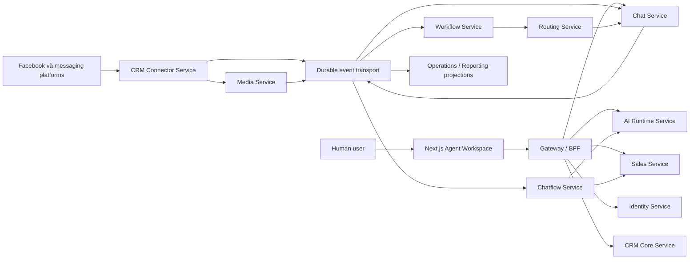

# Kiến trúc đích — enterprise microservices

ADR-021 / PLAN-007 bổ sung: **CRM-native Identity, không Keycloak trong target**; MySQL là authority credential/session/quyền, Redis cache. [Schema catalog](../data/schema-catalog.md) đặt tên/phạm vi database mỗi service; [guideline](../data/database-guidelines.md) bắt buộc tenant_id mọi application table. SRC-038 native auth/tenant-column retrofit đã triển khai trong monolith; physical schema extraction chưa triển khai.

Direction accepted2026-10-06 theo user, ADR-017/CHG-20261006-07. PLAN-005 là blueprint documentation, không phải đã tách source/deploy. [Baseline đang chạy](monolith-baseline.md) vẫn Next.js + NestJS API/worker + MySQL shared schema. SRC-028 implements scoped [independent HTTP ingress](../../services/crm-connector/README.md) under ADR-018, verified in disposable containers; no preview cutover. Remaining exact distributed wire/physical schema/security gates còn PLAN-006; không đánh Ready code extraction bằng tài liệu tổng thể này.

## Ranh giới triển khai

Mỗi bounded context có deploy/release/scale, database credential/migrations, public/internal contract và operational ownership riêng. Một service có thể gồm API và worker processes dùng cùng own database. Giữ Next.js/NestJS/TypeScript/MySQL và tenant isolation; service boundary không thay nghiệp vụ Human/AI owner, consent, Lead hoặc durable versioned workflows.

Mũi tên là logical API/event dependency, không đại diện transaction hoặc lời hứa ordering. Catalog đầy đủ gồm Ticket và từng data boundary ở [services](../services/README.md).

## Nguồn chuẩn của state

- Identity: account/tenant/principal/role/team/authorization. CRM Core: Contact/Company/custom objects, metadata; external registry chỉ projection.
- Chat: Conversation, message/rich JSON/text, Conversation ownership/version và outbound intent. Connector: webhook delivery/connection/credential binding/transport receipt/provider control. Chat owner và provider control là hai state machine.
- Sales/Ticket: owner/version của resource tương ứng. Routing chỉ đề xuất với expected revision; owning service CAS và phát event.
- AI Runtime: full provider lifecycle/config/knowledge/tools/eval và execution. Identity giữ principal ID của Agent; provisioning liên service là saga.
- Workflow/Chatflow: pinned graph/run/session/turn/action receipt. Media: asset/processing/extraction. Reporting/Operations: authorized projections, không business authority.

[Data ownership](../data/service-ownership.md) giải quyết registry/FK/UoW hiện đang gắn chặt. Cấm join/SQL/foreign key/cascade giữa service databases; service account không có quyền DB khác. Local dev có thể chung MySQL instance nhưng databases/users/migration journals riêng; production placement/HA được quyết định qua deployment gate. Shared types/schema libraries không chứa ORM entity/repository/domain implementation.

## Giao tiếp và tính bền vững

REST/OpenAPI dùng cho queries và commands cần response; async commands/events qua durable broker. Chọn baseline thiết kế NATS JetStream (ADR-017), chưa pin/install/deploy; topology, retention/replication, ordering key và failover proof ở PLAN-006. Redis dùng cache/session/ephemeral fan-out hoặc local job wakeup, không là source of truth của business saga. Không tự thêm Kafka/service mesh/Kubernetes chỉ để gọi là enterprise.

Every mutation commits local domain state + local audit/outbox. Relay publish at-least-once; consumer writes inbox+local effect atomic. Unique operation IDs/digests, aggregate versions, bounded retry, DLQ và reconciliation thay transaction xuyên service. Không XA/2PC; không exactly-once claim cho provider. [Contract rules](../contracts/service-boundaries.md).

## Facebook webhook tới Agent Chat UI

1. Connector kiểm challenge/signature trên raw body, xác định asset→tenant connection, durable delivery trước ACK theo provider contract.
2. Parser phân loại messages/echoes/status/postback/control; normalize rich JSON và text original/extracted/preview. Batch thành events độc lập có source keys và schema versions.
3. Connector enrich profile qua provider API/cache, resolve Contact qua CRM idempotent và cache confirmed mapping; Chat nhận IngestMessage với required crm_contact_id và tenant-bound refs, local dedup, lưu Conversation/message/content và outbox. Không shared UoW hoặc webhook chờ synchronous CRM/Chat thành công.
4. Chat API/authorized realtime feed cung cấp JSON cho UI. Chatflow/AI đọc text để inference; consent provenance vẫn original-only. Media extraction hoàn tất gửi event có expected content revision; Chat không overwrite lời gốc/user correction.
5. Human/AI send command vào Chat intent; Connector dispatch sau authorization/owner/control fence rồi trả receipt. Unknown không resend mù. Facebook routing handler sống Connector; CRM owner transition sống Chat.

Hiện mới có mock flow trong monolith; endpoint Meta thật, broker/realtime/media resolver chưa có. Không dùng đường nét sơ đồ để suy ra đã implemented.

## Security và consistency khi owner/quyền thay đổi

Edge xác thực Human hoặc integration, bỏ spoofed internal headers; service xác thực workload identity/audience/signed delegation và tenant trước xử lý. Record owner authority phải nằm cùng DB với intent gate; policy authority ở Identity. Cross-service cache không thay quyền tại dispatch; privileged paths fail closed khi không thể xác nhận.

Takeover: Chat commit owner_revision mới + invalidate queued intents + revoke outbox ngay. Runtime/Chatflow nhận cancel có thể trễ; effects mới vẫn bị Chat/tool-owning service từ chối. Connector cần dispatch permit/lease có revision và operation receipt; exact issue/consume/revoke protocol là PLAN-006 security gate, chưa đủ để bật remote dispatch. Side effect đang in-flight trước revoke có thể hoàn tất; UI giữ unknown/pending/reconciliation trung thực. Không hứa instant distributed cancellation hoặc remote role revoke từ một invalidation event.

## Enterprise operational baseline

Mỗi service cần versioned contracts/consumer compatibility CI, separate images/migrations/runtime grants, health/readiness, redacted OpenTelemetry traces/metrics, structured audit và on-call ownership. Broker durable replicated quorum/failover, MySQL backups/PITR và object-store restore phải test trước production. SLO/error budget/RPO/RTO, load sizing, quotas/retention, regional placement chốt theo deployment evidence; không đặt con số giả hoặc claim HA chưa chạy.

Secrets server-side theo service/provider asset, rotation/revocation có receipts. Service egress allowlists, tenant-aware rate limits, PII minimization và authorized replay. Fault tests bắt buộc: duplicate/reorder, lost ACK, broker outage, downstream timeout, split-brain lease, revocation race, orphan refs, disaster restore.

## Migration và mức sẵn sàng

[Roadmap extraction](../planning/microservices-migration.md) dùng compatibility gateway, strangler extraction, single-writer cutover và reconciliation. Preserve migrations1–18/history/IDs; per-service migration lineage và transferred aggregates có evidence. Không đổi deployed topology hoặc tự reset dữ liệu trong phiên docs. [Tracker](../tracking/tasks.md) là nguồn status, [service catalog](../services/README.md) là nguồn boundary đích.

ADR-019 canonical identity authority and new inbound/outbound Chat contact requirement: [contract](../contracts/contact-resolution.md). Connector cache is not Contact master; no cross-service SQL.
