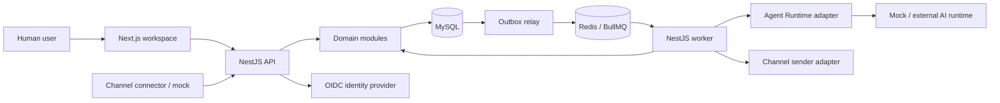

# Baseline triển khai — modular monolith

Status: Current source baseline through SRC-027; retained as migration reference. Target architecture superseded by [ADR-017 / microservices](architecture.md).

## Cấu trúc triển khai

Một repository ứng dụng về sau gồm frontend, backend và shared contracts. API và worker dùng cùng domain code; build/deploy riêng process. Domain module không gọi SQL vào bảng của module khác; gọi application service nội bộ hoặc consume event. Không dùng HTTP giữa module trong monolith.

MySQL 8.4 LTS là system of record; InnoDB, UTF-8 `utf8mb4`, thời gian UTC `DATETIME(6)`. Redis/BullMQ là hạ tầng dispatch/cache, mất Redis không được làm mất workflow business state. Tệp đính kèm và object storage chưa nằm trong M2 text-only.

## Ranh giới và dependency

| Module | Sở hữu | Phụ thuộc trực tiếp |
|---|---|---|
| Identity | Tenant, membership, seat, role, team | Audit interface |
| CRM | Registry, property, association, Contact/Company | Identity, Audit |
| Channels | Connection, external identity mapping, delivery, touchpoint | CRM, Conversation application service |
| Conversation | Conversation, Message, note, outbound intent | CRM registry, Identity, Agent policy |
| Sales | Lead, handoff, Deal, pipeline | CRM, Identity |
| Ticket | Ticket, SLA | CRM, Identity |
| Agents | AI config, capability, routing, assignment history | Identity, CRM ownership service |
| Workflow | Definition/version/run/step/wait | Command interfaces có allowlist |
| Chatflow | Definition/version/session/turn | Conversation, CRM/Sales commands, Agent adapter |
| Reporting | Metric/report/dashboard metadata và projection | Domain event + authorized query interfaces |
| Operations | Audit, outbox, inbox, replay | Hạ tầng; không tự sửa business state |

Registry giữ identity/quyền/owner chung của record; domain service sở hữu lifecycle nội dung. Assignment service khóa record registry và ghi history; caller không tự sửa `owner_principal_id` bằng generic PATCH.

## Giao dịch và bất đồng bộ

Một business command ghi domain state, registry version, audit và outbox trong cùng transaction. Consumer có inbox key `(tenant_id, consumer_name, event_id)`; update business state và đánh dấu inbox complete cùng transaction. Outbox relay có thể phát lặp, consumer phải idempotent.

Webhook đầu vào chỉ ACK sau khi delivery được lưu bền vững. Worker normalize rồi xử lý theo [inbound contract](../contracts/api.md). Luồng M2 tạo Contact/Conversation/Message/touchpoint/outbox trong một transaction ứng dụng; module gọi nội bộ dùng chung unit of work.

External I/O nằm ngoài database transaction. Ghi outbound/tool intent trước, thực thi sau; lưu kết quả riêng. Không tuyên bố exactly-once đối với provider không hỗ trợ idempotency/reconciliation.

## Thực thi AI và automation

Trong mode CRM-managed M2, Runtime không truy cập trực tiếp DB và không giữ secret channel. Backend xác thực từng tool call bằng tenant, actor, capability, quyền hiện hành và owner revision. Workflow chạy bằng tenant service actor có role/allowlist rõ; service actor không được làm owner và không có quyền quản trị mặc định.

Các quyền workflow là giao của execution role đã gắn ở version, allowlist primitive và quyền hiện hành của service actor. Actor bị disable thì run pause/failed, không tự nâng quyền bằng người publish.

## Deployment và tiến hóa

- Local/dev: frontend, API, worker, MySQL, Redis và OIDC dev provider; fixture riêng cho hai tenant.
- Production về sau: TLS edge, private DB/Redis, secret manager, health/readiness, backup restore drill; triển khai worker cùng version contract tương thích với API.
- Migration áp dụng trước code cần schema mới; ưu tiên expand → backfill → switch → contract. Không drop field mà run/version cũ còn đọc.
- Rollback code chỉ khi schema/event còn tương thích; với migration phá hủy dùng forward fix, không hứa rollback dữ liệu đã mất.
- M1–M2 chưa tách microservice, không đưa Kafka/warehouse vào dependency bắt buộc. Reporting lớn và engine orchestration thay thế cần ADR dựa trên tải đo được.

Frontend không truy cập DB; mọi quyền đi qua backend. API backend là REST `/api/v1`; M2 inbox dùng polling cursor mỗi 5 giây, realtime stream là mở rộng sau.

## Kế hoạch đóng gói và source

Chi tiết topology/health/migration/dev-test-release image ở [Docker plan](docker-development.md). API và worker dùng chung backend image khác entrypoint; Compose là môi trường local và release smoke, chưa phải cam kết triển khai production. TypeORM/mysql2 dùng explicit migrations, không schema auto-sync; frontend Next.js standalone khi build release.

Source organization, contracts-first tooling, OIDC dev và milestone gates nằm ở [build plan](../planning/build-plan.md). Exact dependency versions và physical/auth contract refinement đã hoàn tất SRC-001; Docker/source scaffold SRC-002/003 đã chạy. Migration và domain modules tiếp tục theo tracker.

SRC-008 / ADR-014: relay M1 dispatch qua transactional registry trong worker với durable MySQL backlog; Identity access consumer acknowledge sau validation, quyền vẫn đọc DB trực tiếp. BullMQ job wakeups cho workflow/runtime ở tasks sau. Registry chưa chứa CRM consumers.

## M3 — Provider platform và CRM Connector boundary

ADR-016 / CHG-20261006-03 mở rộng boundary: AI provider có configuration/lifecycle và có thể host hội thoại; CRM Connector là messaging transport + provider control. Sơ đồ và execute/tool guards M2 phía trên giữ cho mode CRM-managed. Mode provider-managed ingest reply/standby và điều phối handoff; không ép hosted provider gửi qua proposal-only runner M2. CRM vẫn sở hữu tenant/ACL/record owner/business workflow; callback/tool qua application ports, không cho truy cập DB trực tiếp. Exact M3 ports và control synchronization còn Draft trong [plan](../planning/m3-provider-plan.md).
