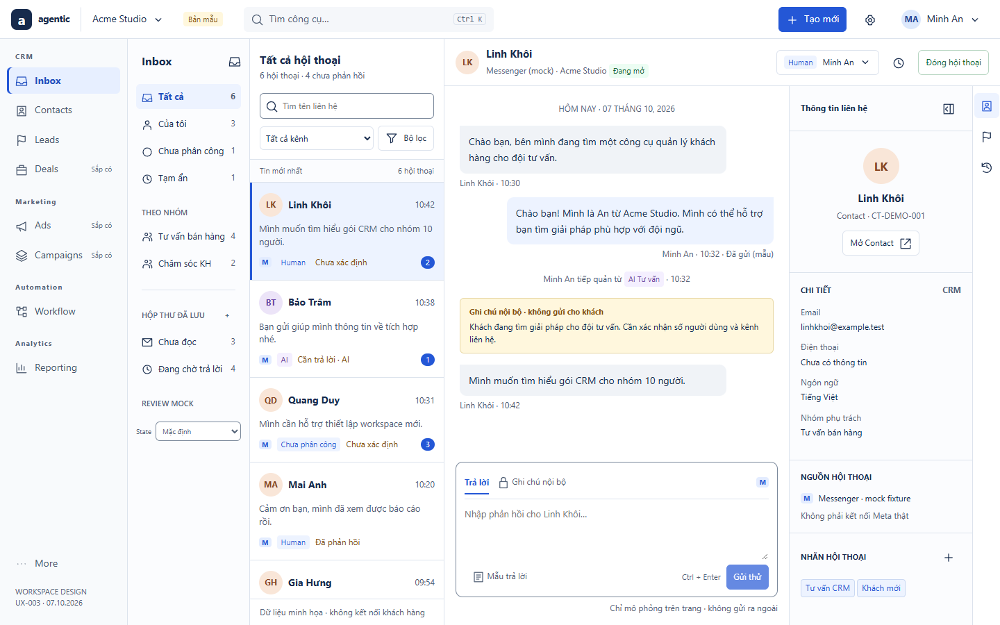

# UI/UX — hệ thống thiết kế ứng dụng

UX-004, 2026-10-07: bỏ tab bar dưới header, thay thiết kế work tabs UX-003. Đây là bộ thiết kế đích và mock độc lập, chưa thay giao diện ứng dụng đang chạy.

| Thứ tự đọc | Tài liệu | Phạm vi |
|---|---|---|
| 1 | [Nghiên cứu và quyết định](research-app-shell.md) | Đối chiếu sample, source hiện tại và chuẩn usability/accessibility |
| 2 | [Tiêu chí và UX guidelines](guidelines.md) | Quy tắc dùng chung, design tokens, đo lường và checklist |
| 3 | [App shell](app-shell.md) | Header, search, tạo object, navigation, user/workspace |
| 4 | [Inbox screen specification](inbox-screen.md) | Anatomy, luồng, trạng thái, API/gate, acceptance |
| 5 | [Mock tương tác Inbox](mockups/inbox.html) | Desktop/mobile, dữ liệu synthetic, chạy độc lập không gọi API |
| 6 | [Agent Chat chi tiết](agent-chat-workspace.md) | Nghiệp vụ UX-CHAT-01…22; layout shell được cập nhật bởi UX-003 |
| 7 | [Mẫu đặc tả màn hình](../templates/ux-screen.md) | Bắt buộc dùng cho các màn tiếp theo |

## Danh mục màn hình

| ID | Màn hình | Đặc tả / mock | Mức sẵn sàng |
|---|---|---|---|
| APP-01 | Shell dùng chung | app-shell.md / mockups/inbox.html | Ready UX; search toàn CRM và profile editor có gate riêng |
| INBOX-01 | Quản lý hội thoại | inbox-screen.md + agent-chat-workspace.md / mockups/inbox.html | Ready UX; source SRC-035/036/037 chưa hoàn tất |
| CRM-01 | Contacts | Chưa đặc tả redesign | Backlog UX; giữ renderer hiện tại |
| CRM-02 | Leads | Chưa đặc tả redesign | Backlog UX; giữ qualification/handoff hiện tại |
| CRM-03 | Deals | Chưa đặc tả / chưa mock | Draft M4 |
| MKT-01/02 | Ads / Campaigns | Chưa đặc tả / chưa mock | Draft; nav chỉ là IA đích |
| WF-01 | Workflow | Chưa đặc tả redesign | Run/definition read-only có baseline; builder Draft |
| RPT-01 | Reporting | Chưa đặc tả / chưa mock | Draft; không dùng số KPI giả |
| MORE-01 | More | Quy tắc menu trong app-shell.md | Link tới công cụ có quyền/đã triển khai |

Chỉ Inbox được thiết kế đầy đủ trong phiên này. Khi thêm màn hình: claim task → đọc domain/contract → viết spec theo template → mock default + failure + responsive → review → acceptance/evidence/log. Không đánh dấu màn khác Ready từ một dòng navigation.

## Preview và review

Mở mockups/inbox.html trực tiếp bằng browser; không cần server hoặc tài khoản. Có dữ liệu synthetic để nhìn bố cục; chọn trạng thái ở Review mock, trên mobile mở menu hàng chờ. Contact/Lead dialogs chỉ thử draft; menu ngoài Inbox giải thích scope. Chưa có global CRM search, API calls hoặc lưu database.

[Mobile list](mockups/previews/inbox-mobile-list.png) · [Mobile detail](mockups/previews/inbox-mobile-detail.png) · [Owner conflict](mockups/previews/inbox-owner-conflict.png) · [Review results](mockups/previews/review.txt).

Tái kiểm mock: Node24 + Playwright đã cài trong repository + Chrome, chạy `node docs/ux/mockups/review.mjs` từ repository root. Script mở file local, kiểm interaction/layout và ghi screenshot; không kết nối backend. Full app acceptance và user study vẫn NOT_RUN.

## Runtime implementation — SRC-039

Shell không work tabs và Inbox presentation hiện có trong ứng dụng local. [Implementation evidence](../tracking/details/SRC-039.md): API-backed queue/search/filters, messages/notes, reply/takeover, Contact dialog, draft guards; browser9 scenario groups/6 viewport và web build PASS. Mock phía trên là tài liệu thiết kế, không thay bằng runtime screenshot. SRC-035/036/037 còn Contact channels, saved-inbox lifecycle, read-marker, snooze/actions, full activity và release gates.
