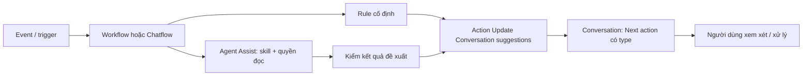

# Conversation suggestions và Agent Assist

Status: Product scope accepted by user2026-10-07, UX-006 / CHG-20261007-10. Supersedes independent need_response classification in UX-005 and AI-only classification in SRC-041 design. Exact persistence/API/action contracts remain PLAN-008; current runtime has unknown/sent projection only, no stored Next action or Assist integration.

## Phần 1 — Thuộc tính và action của Conversation

Conversation sở hữu một gợi ý hành động hiện tại, có type dùng làm phân loại trên UI. Đây là dữ liệu hỗ trợ xử lý hội thoại, độc lập với việc kết quả được tạo bởi AI hay quy tắc cố định.

| Thành phần logical | Ý nghĩa |
|---|---|
| next_action.type | Loại gợi ý được gán: response, create_lead, create_ticket, close_chat; thay thuộc tính need_response độc lập |
| next_action | Gợi ý hành động tiếp theo, optional; không phải lệnh tự thực thi |
| source | Nguồn rule hoặc agent; workflow/chatflow run, step và version đã áp dụng |
| basis | Tenant, Conversation và inbound sequence/revision mà kết quả đang xét |
| assessment revision/time | Phát hiện ghi đè, kết quả đến trễ và hiển thị độ mới |

Cung cấp logical action “Update Conversation suggestions”: nhận Next action có type (có thể xóa toàn bộ về null), kiểm schema, tenant, quyền, basis/revision và idempotency, rồi lưu qua Chat owning application port/API. Chỉ sửa nhóm thuộc tính gợi ý; không sửa Contact/Lead/Deal, owner, gửi message hoặc thực thi hành động được gợi ý. Chat là authority của dữ liệu Conversation. Đây là logical contract, chưa đặt endpoint/action key hoặc DDL giả là đã có.

UI đọc các thuộc tính đã lưu, hiển thị nhãn và Next action cùng nguồn. UI không gọi AI để tự suy ra trạng thái. Không có Next action thì hiển thị “Chưa xác định”, không dựng đề xuất giả. “Đã phản hồi” là trạng thái có bằng chứng sent, tách khỏi nhãn hành động; không suy ra từ next_action=null hoặc type khác response. Không lưu thêm boolean need_response song song.

## Phần 2 — Workflow/Chatflow điều phối

Workflow hoặc Chatflow quyết định trigger, điều kiện, lúc chạy và cách tạo đề xuất. AI là lựa chọn trong quy trình, không là dependency bắt buộc của Phần 1.

Hai nhánh dùng cùng update action và cùng validation, audit, retry/dedup, revision guards. Ví dụ rule được cấu hình có thể gán “Cần trả lời” và “Kiểm tra thông tin khách yêu cầu” mà không gọi AI. Nhánh AI có thể đề xuất hành động theo skill/context; workflow/chatflow kiểm kết quả rồi gọi action bằng service actor có quyền. Không tự bật rule hoặc agent chỉ vì tồn tại định nghĩa.

## Agent Assist: định nghĩa và quyền

Agent Assist là một AI agent được cấu hình skill/instruction, context được đọc và quyền hạn riêng. Không phải một classifier hard-code trong Conversation và không mặc nhiên là owner của hội thoại.

- Được đọc context đã lọc theo tenant/object/field và sử dụng skill/tool nằm trong allowlist để tạo đề xuất có cấu trúc.
- Không có tool trực tiếp cập nhật CRM/Conversation, không gửi phản hồi công khai, đổi owner hoặc thực thi Next action. Việc lưu thuộc tính gợi ý do action của orchestrator thực hiện bằng quyền riêng.
- Kết quả AI là dữ liệu đầu vào cần validate; không chứa quyền ủy nhiệm, arbitrary tool name hoặc chỉ thị được thực thi mặc nhiên.
- Assist không cần chiếm owner Human. Không dùng policy auto-reply của agent owner để ngầm cấp quyền cho Assist. Runtime hiện tại owner-bound/mock cần contract mode riêng trước reuse.

## Vòng đời và concurrency

1. Khách nhắn mới: vô hiệu hóa Next action thuộc lượt trước, next_action=null / “Chưa xác định”.
2. Nếu có workflow/chatflow được cấu hình, quy trình chạy nhánh rule hoặc AI và ghi kết quả qua update action. Không quy trình, đang chạy, lỗi hoặc abstain: giữ chưa xác định.
3. Nhãn “Cần trả lời” đến từ next_action.type=response được quy trình hợp lệ gán; không tự suy ra từ unread, thời gian chờ hay message direction.
4. Phản hồi sent bao phủ inbound hiện tại: cập nhật trạng thái gửi độc lập và giải quyết gợi ý response đúng revision. Không tự coi create_lead/create_ticket/close_chat đã hoàn tất chỉ vì gửi một tin. Tin khách mới trong khi gửi vẫn làm lượt mới chưa xác định; kết quả quy trình cũ không được phục hồi gợi ý hết hiệu lực.
5. Note nội bộ không phải reply và không tự đánh giá. Next action hết hiệu lực cùng assessment; lưu đề xuất không đồng nghĩa hành động đã hoàn tất.

Mọi update kiểm tenant, current inbound basis, lifecycle, authorization và expected assessment revision. Cả AI lẫn rule đến trễ sau inbound mới/sent/close đều bị từ chối theo cùng guard. Hai quy trình cạnh tranh phải xử lý conflict có chủ đích; không last-write-wins âm thầm. Retry giữ action key, không tái gọi AI hoặc ghi đè theo kết quả cũ mà thiếu kiểm tra. Không gửi transcript/credential thật vào audit.

## Gate triển khai PLAN-008

A. Chốt exact next_action.type catalog/payload, trạng thái gửi độc lập và legacy need_response cutover, DDL/tenant ownership, update action/API, ACL, migration/compatibility và acceptance. Phần này phải kiểm thử được chỉ bằng rule, không cần model/provider.

B. Chốt trigger/binding và action registration Workflow/Chatflow, service actor permission, Agent Assist skill/config/read-only tool profile, structured output, stale-result/dedup/cancellation và audit provenance. Publish version không tự cấp thêm quyền. Quy trình nào thực thi hành động thật sau này là use case/quyền riêng, không thuộc suggestion update.

Acceptance tối thiểu: rule-only update; AI proposal qua orchestrator; direct Assist write/send denied; new inbound reset; late rule/AI rejected; concurrent update conflict; tenant/field denial; retries dedup; no configured process stays unknown; sent with newer inbound stays unknown. Đây là thiết kế, chưa phải evidence runtime.

[Workspace contract](../contracts/agent-chat-workspace.md) · [Agent Runtime](../contracts/agent-runtime.md) · [Workflow](../modules/workflow.md) · [Build plan](../planning/agent-chat-workspace.md).

## Catalog type và hiển thị trên conversation list

| next_action.type | Nhãn trên item | Ý nghĩa |
|---|---|---|
| response | Cần trả lời | Gợi ý phản hồi khách |
| create_lead | Cần tạo Lead | Gợi ý ghi nhận nhu cầu thành Lead |
| create_ticket | Cần tạo Ticket | Gợi ý tạo yêu cầu hỗ trợ |
| close_chat | Đề xuất đóng hội thoại | Gợi ý kết thúc hội thoại, không tự đóng |
| next_action=null | Chưa xác định | Chưa có gợi ý hiện hành; không phải đã phản hồi/đã hoàn tất |

Một Conversation có tối đa một next_action hiện hành trong scope này; nhiều gợi ý đồng thời cần thiết kế riêng. Type được mở rộng qua catalog/contract version có đăng ký, không nhận tên action tùy ý từ AI. Type chưa được client nhận diện hiện nhãn trung tính “Có gợi ý hành động”, không dispatch tool tự động.

Ví dụ logical payload (chưa là wire schema đã triển khai): next_action gồm type=create_lead và mô tả tùy chọn; source/basis/revision theo bảng trên. Client map type qua catalog nhãn/icon, mô tả chỉ là dữ liệu hiển thị. Không suy đoán bằng nội dung mô tả hoặc tồn tại agent. Mọi type được gán cùng action Update Conversation suggestions, bất kể nguồn rule hay Assist.

Type/nhãn không phải bằng chứng module đã triển khai hay quyền tạo record. Ví dụ create_ticket có thể là gợi ý đọc được, nhưng nút thực hiện chỉ xuất hiện khi có công cụ và quyền tương ứng. Gán type không tạo Lead/Ticket, gửi reply hoặc đóng chat. Lifecycle closed và trạng thái đã phản hồi hiển thị riêng, không phải next-action type.

Compatibility: runtime SRC-041 hiện vẫn dùng need_response; thiết kế đích bỏ field độc lập này. PLAN-008 phải chốt rollout/retire hoặc compatibility projection cho client cũ trước thay API. Không map mọi type khác response thành false/“Đã phản hồi”. Không migration lịch sử hoặc đổi runtime trong UX-006.
