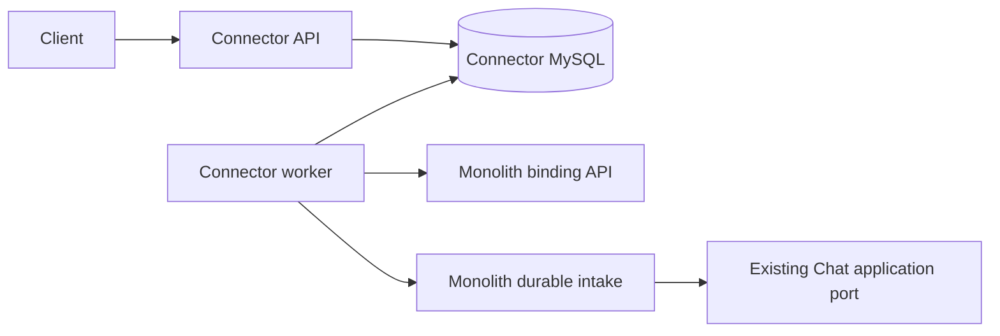

# CRM Connector — durable HTTP ingress bridge

SRC-028 implementation of [bridge v1](../../docs/contracts/connector-bridge.md). [Service design](../../docs/services/crm-connector.md) describes the broader target. This release accepts normalized mock text/rich messages. Optional signed Messenger capture is implemented separately under SRC-029; provider sends, JetStream and Chat extraction remain separate gates.

## Scope and architecture

`src/http.ts` owns Nest ingress/status/health. `validation.ts` consumes shared contracts only. `store.ts` owns authentication, local transaction/audit, dedup and leases. `worker.ts` checks the remote binding before each forward/poll. `schema.ts` owns sequential immutable migration1–2/checksum journal; `grants.ts` provisions restricted local runtime grants. `main.ts` provides API/worker and explicit operator commands. No backend domain imports or cross-database queries.



Message lifecycle: queued → forwarded → completed; blocked means a permanent auth/binding/remote processing failure; attention means 10 consecutive transient failures. A normal pending receipt polls every 5s without exhausting the error budget. Lease30s, request timeout5s, fence token and local active binding checks; retry delay1/5/30/120/600s. Network I/O is outside transactions. The remote event ID remains stable across lost ACK and restart.

## Data model

| Owned table | Meaning / keys |
|---|---|
| connector_schema_migration | Independent version/name/checksum/state journal; partial DDL fails closed |
| connector_connection | Immutable tenant + local UUID + SHA256 ingress token; remote connection UUID and secret env name; active/disabled |
| connector_delivery | Tenant+connection+event unique; canonical payload hash/JSON; status, attempts, consecutive errors, lease/fence, next attempt, remote receipt ID |
| connector_audit | Local mutation IDs/action/status/time only; no message content or credentials |

FKs stay inside this DB. API/worker credentials cannot access monolith DB or execute DDL. Migration/provision/grant use separate operator credentials. Status returns sanitized metadata, never payload. Backups/retention/restore/alerts require the production operations gate.

## Local runbook (opt-in)

Use a dedicated local environment file outside source control, permission0600. Generate new secrets; never reuse production values. Required variables:

- `CONNECTOR_MIGRATION_PASSWORD`, `CONNECTOR_DB_PASSWORD`: distinct random passwords, at least24 characters for runtime.
- `CONNECTOR_CONNECTION_ID`, `CONNECTOR_TENANT_ID`, `CONNECTOR_REMOTE_CONNECTION_ID`: explicit UUIDs. Tenant must match the downstream mock connection.
- `CONNECTOR_INGRESS_TOKEN`, `CONNECTOR_REMOTE_TOKEN_LOCAL`: independently generated64 lowercase hex; downstream token must already match the monolith connection.
- `CONNECTOR_REMOTE_ORIGIN`: trusted HTTPS origin, no path/query/credentials. Local Docker Desktop may explicitly use `http://host.docker.internal:8080` with `CONNECTOR_ALLOW_HTTP=true`. The destination must run the new binding route; old preview images do not.

Commands below assume an operator-prepared `.local/connector.env` (ignored). No auto seed, migration of preview, gateway switch or reset is performed.

```sh
docker compose --env-file .local/connector.env -f compose.connector.yaml build connector-api
docker compose --env-file .local/connector.env -f compose.connector.yaml up -d connector-mysql
docker compose --env-file .local/connector.env -f compose.connector.yaml run --rm connector-admin node dist/main.js migrate
docker compose --env-file .local/connector.env -f compose.connector.yaml run --rm connector-admin node dist/main.js grant
docker compose --env-file .local/connector.env -f compose.connector.yaml run --rm connector-admin node dist/main.js provision
docker compose --env-file .local/connector.env -f compose.connector.yaml up -d connector-api connector-worker
```

Grant does not rotate an existing password or revoke permissions; it rejects an existing user with unrelated/excess privileges. Provision is idempotent only for the same immutable binding. Remapping queued data is deliberately unsupported. API/worker startup verifies schema and never runs DDL. Use status/audit to inspect blocked/attention deliveries; automatic operator replay is outside this slice.

POST `/connector/v1/deliveries` uses the existing normalized intake DTO and `X-Connection-Id` plus `Authorization: Bearer …`; GET `/connector/v1/deliveries/{id}` uses the same credentials. Cookie, Origin, tenant overrides and queries are rejected. Body max64KiB. API liveness `/connector/v1/health/live`, readiness `/connector/v1/health/ready`; remote outage leaves durable intake available.

Rollback: stop API intake, drain or retain the private queue, stop worker; leave its volume intact. Do not repoint existing messages to another tenant/connection. Existing monolith endpoints remain available; this slice changes no monolith migration history and does not cut over a tenant.

## Validation

`node scripts/connector-smoke.mjs` builds/runs the non-root release image against a new disposable private MySQL project and cleans only that project. `pnpm verify:container` checks the workspace; `node scripts/integration.mjs` runs disposable MySQL and real HTTP Connector→monolith tests. Evidence and limitations: [SRC-028](../../docs/tracking/details/SRC-028.md).

## Optional Messenger capture (SRC-029)

[Exact contract](../../docs/contracts/messenger-ingress.md). GET/POST `/connector/v1/messenger/{appId}/webhook` accepts signed provider-shaped payloads into private `connector_meta_event`; it never sends them through normalized mock intake. `captured` is local retention, not Chat delivery. Echo/standby/control/unknown events stay `attention`. No read-content endpoint, external fetch, provider send or automatic responder is enabled.

Explicit migration upgrades schema1→2 without changing bridge rows. Re-run `migrate` and `grant` before deploying this version; old binaries must not be restarted against schema2 (their readiness fails closed). No down migration. Restore of pre-upgrade backup requires preserving newer captures first; default recovery is forward fix.

In the private environment file, set `CONNECTOR_META_APPS` to a JSON array containing `id`, `secret_env:"CONNECTOR_META_APP_SECRET"`, `verify_env:"CONNECTOR_META_VERIFY_TOKEN"`; use a real App ID only when ready for sandbox. Set the two referenced values separately (>=32 characters; random synthetic secrets for local tests). The checked-in Compose exposes only these two env names; multiple apps require explicitly adding the corresponding env references to an operator override. Never put values in command arguments, screenshots, fixtures or logs.

Set `CONNECTOR_META_BINDING_ID`, `CONNECTOR_TENANT_ID`, `CONNECTOR_META_APP_ID`, `CONNECTOR_META_PAGE_ID`; run `connector-admin node dist/main.js provision-meta` with the same Compose/env file. Binding is immutable and idempotent; disable via privileged operator DB transaction until an authorized administration API exists. Unknown/disabled pages reject the entire batch. Runtime grants cannot mutate bindings. Production subscription/TLS/App Review, retention cleanup, rate/restore/SLO and sandbox remain pending; do not subscribe a real Page to this capture-only endpoint as a completed CRM integration.

`messenger.ts` owns signature/challenge/normalization; `messenger-store.ts` owns local batch transaction and audit; `messenger-schema.ts` is additive lineage2. Local tests use generated synthetic HMAC keys and MySQL, without contacting Meta. Audit stores IDs only; event JSON is sensitive private data, not an operational log.

## SRC-030 contact resolution

Worker cache is process-local, bounded to1000 mappings with non-sliding5min TTL. Miss calls CRM lookup; only explicit null calls idempotent resolve/create. Successful replies are checked for tenant/connection/subject/CRM IDs before cache population and contact-bound forwarding. CRM DB remains SoT; restart repopulates from lookup. Live binding is checked for every forward/poll. Errors never mean absence.

Deploy upgraded backend API **and worker** before this Connector worker. Pending version2 inbound payloads require the upgraded backend worker; drain them before backend rollback. See [compatibility contract](../../docs/contracts/contact-resolution-local.md). No new credentials, database schema or environment variable. Optional signed Messenger capture and provider enrichment are not connected to this path.

Before upgrading the Connector worker, stop accepting new mock deliveries and drain the old worker queue (including lost-ACK retries). Legacy and v2 payload hashes intentionally differ for the same provider_event_id, so a partially forwarded legacy delivery must be reconciled/drained with the old worker rather than blindly replayed using v2. Resume ingress after backend and Connector upgrades.
